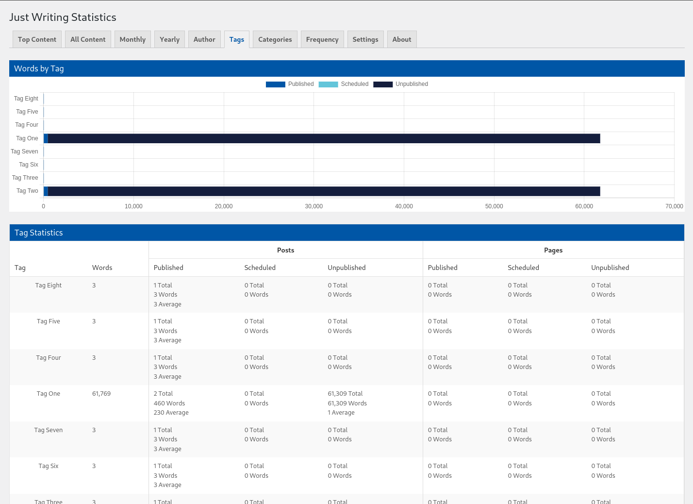
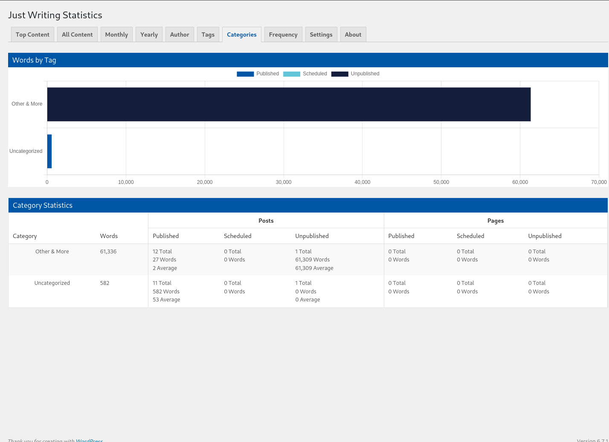
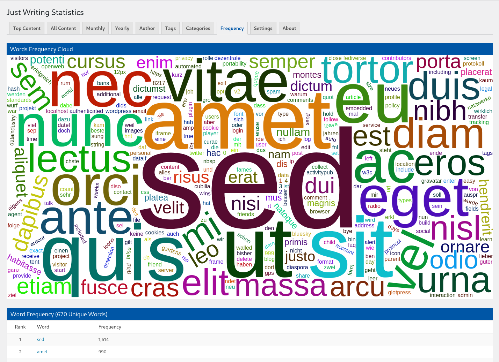

# Just Writing Statistics #
**Contributors:** [gregross](https://profiles.wordpress.org/gregross/), [redlettuce](https://profiles.wordpress.org/redlettuce/)  
**Tags:** word count, reading time, authors, words, writing  
**Requires at least:** 4.6  
**Tested up to:** 6.7.1  
**Stable tag:** 5.1  
**License:** GPLv2 or later  
**License URI:** http://www.gnu.org/licenses/gpl-2.0.html  

Calculate your writing statistics on your WordPress site.

## Description ##

**Just Writing Statistics is a fork of WP Word Count**

Just Writing Statistics tells you exactly how many words you've written on your site with statistics by:

- Top Content
- All Content
- Month
- Year
- Author
- Tags
- Categories
- **Frequency (new!)**

Just Writing Statistics also has reading times for each post and page of your site. Find out how many hours of content you've written or let readers know how long your articles are. You can include reading time at the top of each of your posts automatically or use a shortcode.

## Features ##

- Quickly see how many posts and pages you've created and how many total words they add up to.
- View and display estimated reading times for each piece of content on your site.
- Support for custom post types so you can monitor word counts from content created by your themes and plugins.
- View your writing output for each month broken down by post type.
- See all of your site author's word counts with breakdowns by post type.

## Installation ##

1. Upload `just-writing-statistics` to the `/wp-content/plugins/` directory
2. Activate the plugin through the 'Plugins' menu in WordPress
3. Just Writing Statistics can be accessed via the menu of the WordPress Admin.

## Frequently Asked Questions ##

### What are stopwords and why would I care? ###
Stopwords are common words like "the" or "at" that don't really add much to the word frequency count statistics but might dominate due to how oftne they are used.

The stopwords list that Just Writing Statistics uses comes from [here](https://github.com/stopwords-iso/stopwords-iso) if you want to see what gets excluded per language.

### Why fork WP Word Count? ###

***UPDATE TO THE UPDATE***
WP Word Count has been off the plugin directory again since June 2024, and the redlettuce website is no longer available, so I guess it's done for good this time.
******

***UPDATE***
WP Word Count is back on the plugin directory, but still seems to be getting very little attention from the developers.

Since I've already done all the work to fork it and publish it in the plugin directory, I'll continue to support this version going forward.

Also Just Writing Statistics has a lot of features that were only included in the Pro version of WP Word Count, so there's that too.
******

WP Word Count is by far the best plugin of its kind, however it is, as far as I can tell, abandoned at this point.

Even worse, the existing plugin has a known security vulnerability in it and so wordpress.org has closed the repository.

As such, a fork is required to fix the security issue and bring the plugin functionality back.

### I've got a very large site, how's the performance going to be? ###

Statistics are inherently resource intensive, the large your site is, the slower the statistic generation will be.

For the general content/monthly/yearly/author based statistics, these should remain quick to display no matter the site size as a custom table is used to gather the data whenever a item is saved.

For Tags and Categories this is not the case and these are calculated at display time.  Even with a largish site, this should not be significant, a few seconds at worst.  If this becomes an issue I'll look into converting this code over to a custom table as well.

### Why do I see post types in the settings tab that I don't see on any of the statistics tabs? ###

If a post type has no items associated with it, Just Writing Statistics will not include it in the statistic displays.

### Do I really have to calculate the statistics by date range? ###

Probably not, but make sure to wait for the progress bar to disappear before reloading the page.  If it is running for more than five minutes, then it's probably failed silently and you'll need to break up the calculation into chunks.

However, even on a modest hosting provider, it would take hundreds of thousands (maybe millions) of posts to get to this point.

### How do the Just Writing Statistics Shortcodes work? ###

There are two shortcodes available:

* [just-writing-statistics] will display the number of words on any page or post.
* [just-writing-statistics-reading-time] will display the reading time of words on any page or post.

Every Just Writing Statistics shortcode can be extended with "before" and "after" attributes to add text or HTML before and after the result.

Example: [just-writing-statistics before="This post has" after=" total words."]

## Screenshots ##

### 1. Top Content Statistics ###

### 2. All Content Statistics ###

### 3. Monthly Statistics ###

### 4. Yearly Statistics ###

### 5. Author Statistics ###

### 6. Tag Statistics ###

### 7. Category Statistics ###

### 8. Word Frequency Statistics ###

### 9. Settings ###

## Changelog ##
### 5.0 ###
* Release date: November 28, 2024
* Add Frequency statistics.
* Fix date range based statistics recalculation.
* Update the charting library.
* Other minor fixes and updates.

### 4.8 ###
* Release date: November 22, 2024
* Fix security issue with date ranges in the admin page statistics recalculation option.
* Fix non-working date range code in the admin page statistics recalculation option.
* Fix optional deleting of data in the admin page statistics recalculation option.

### 4.7 ###
* Release date: July 11, 2024
* Add support for rlt languages in the admin screens.
* Add colour to the charts for authors.

### 4.6 ###
* Release date: April 27, 2024
* Fixed debug warning.
* Added filtering of reading time output (both for shortcodes and when added to top of post content) to limit to only supported post html (aka strip out scripts and other unwanted html, see wp_kses_post() for details).

### 4.5 ###
* Release date: January 31, 2024
* Fixed incorrect calculation of monthly/yearly/author item counts.

### 4.4 ###
* Release date: January 15, 2024
* Added option to disable plugin based on WordPress roles

### 4.3 ###
* Release date: Dec 14, 2023
* Fixed possible null error on some stat pages
* Fixed display of datepicker element when regenerating statistics for a date range
* Fixed missing yearly statistics for some data due to incorrect variable name

### 4.2 ###
* Release date: April 25, 2023
* Fixed incorrect wordcount when a post has no text content
* Improved I18N, thanks @alexclassroom

### 4.1 ###
* Release date: Jan 20, 2023
* Added word count column to admin post/pages list
* Fixed various WP_DEBUG warnings
* Fixed total boxes on top/all content page from showing post types that were marked as excluded
* Fixed total boxes arranging correctly on small screens
* Moved table titles into the table headers to fix corner cases where they were shorter than the table under them
* Misc settings cleanups

### 4.0 ###
* Release date: Dec 28, 2022
* Tested up to WordPress 6.1.1
* Fork from WP Word Count
* Security fixes
* Removal of Pro references
* Fix the menu icon
* Fix the settings link in the plugin list
* Fix various wp_debug warnings
* Added yearly statistics
* Added tag statistics
* Added category statistics
* Combined Read Time and Calculate into a Settings tab
* Added about tab
* Add graphs to the statistic tabs
* Added scheduled posts as a grouping for statistics separate from unpublished
* Added setting to exclude post types

### 3.2.3 ###
* Release date: 6 Oct 2021
* Tested up to WordPress 5.8.1
* We've been a bit quiet (sorry!), but busy behind the scenes! Get ready for some new features ready in Q4 2021!

### 3.2.2 ###
* Release date:  8 Sept 2020
* Tested up to WordPress 5.5.1

### 3.2.1 ###
* Release date:  2 June 2020
* Tested up to WordPress 5.4.1
* Updated plugin details

### 3.2.0 ###
* Release date: 2 Jan 2020
* New "Reading Time" statistic throughout the plugin.
* Added support for Gravatar/User Profile Images.

### 3.1.0 ###
* Release date: 8 Sept 2019
* New calculation options for sites with extremely large amounts of content.
* Menu changes.

### 3.0.2 ###
* Release date: 12 Apr 2019
* Interface changes.

### 3.0.1 ###
* Release date: 13 Sept 2018
* Interface changes and bug fixes.

### 3.0.0 ###
* Release date: 21 Feb 2017
* You can calculate your word counts any time you wish via the "Calculate" tab. This should help alleviate problems with plugin activation/updating on servers with limited resources.
* Automatically excluding common WordPress post types: Custom CSS, Navigation Menu Items.
* Support for Scheduled Posts.
* Support for Thrive Content Builder.
* Interface changes.
* General bug fixes.

## Upgrade Notice ##

To generate the frequency statistics for your existing data after upgrading to version 5.0, go to Settings->Calculate Writing Statistics->Calculate Writing Statistics.

Note this may take a significant amount of time depending upon the number of posts you have on your site.